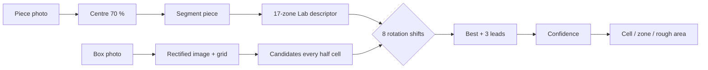

# PuzzleIt

[](https://github.com/LilyanLefevre/PuzzleHelper/actions/workflows/ci.yml)

Stuck on a 1000-piece sky? Photograph a loose piece and PuzzleIt shows **where it goes on the box image**,
how to turn it, and how sure it is. Android, Kotlin, fully offline.

| Puzzle table | Result | Second lead | Blurry photo |
|---|---|---|---|
|  |  |  |  |

*(captures from the instrumented tests, on synthetic box art)*

## How it works



Colour is compared in 17 zones (centre + 2 rings x 8 sectors) of a disc scaled to the piece size, so scale and
lighting matter little; rotating the piece is a cyclic shift of the sectors. Code: `feature/recognition/PieceMatcher.kt`.

## Build and test

```bash
./gradlew assembleDebug testDebugUnitTest      # JDK 21
./gradlew connectedDebugAndroidTest            # phone or emulator
```

## Architecture
Single activity, MVVM, Hilt, Room, CameraX, OpenCV (box processing). Details and conventions: [`.claude/CLAUDE.md`](.claude/CLAUDE.md).
