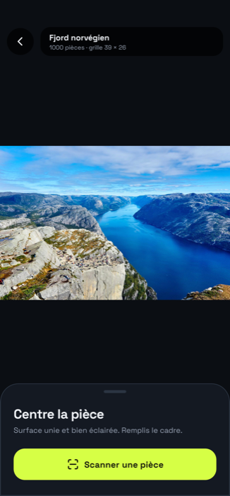
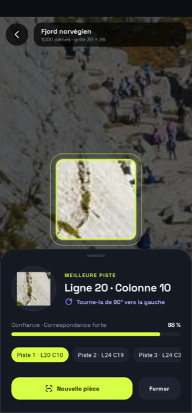
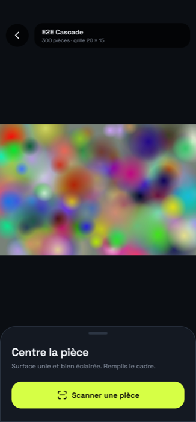
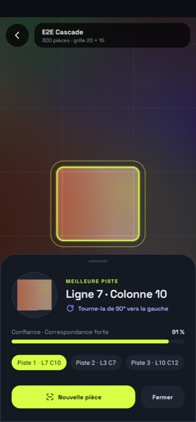
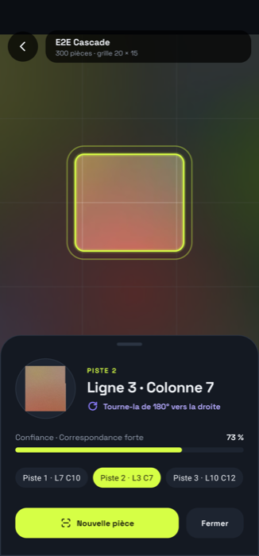
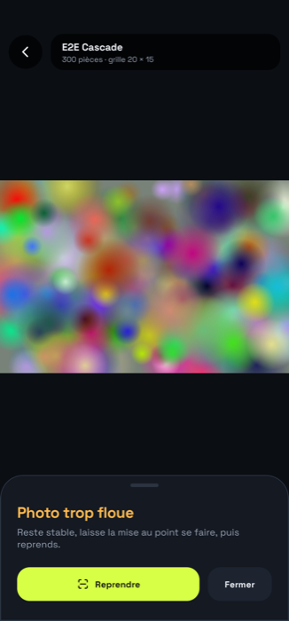
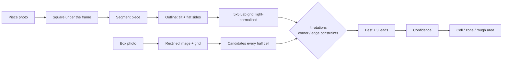
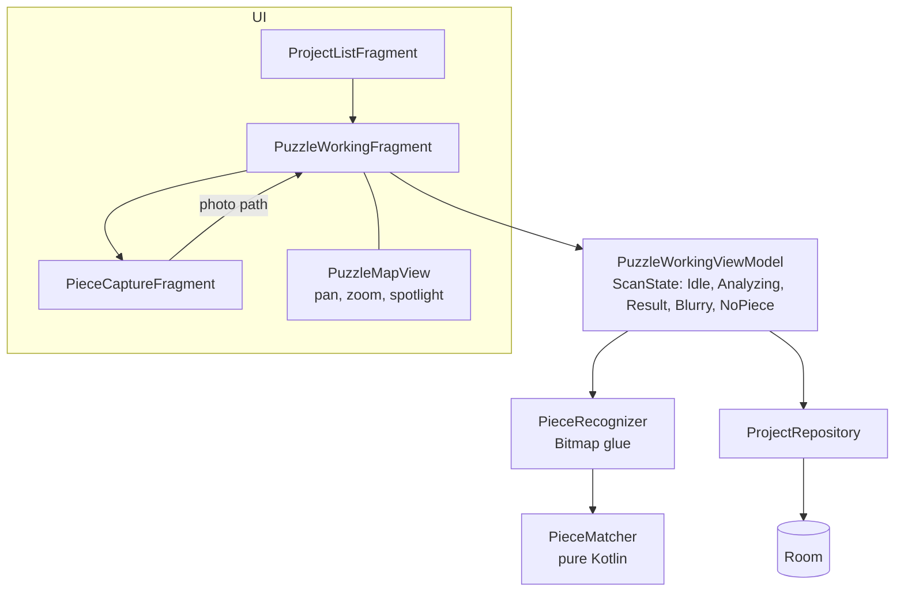

# PuzzleIt

[](https://github.com/LilyanLefevre/PuzzleHelper/actions/workflows/ci.yml)

Stuck on a 1000-piece sky? Photograph a loose piece and PuzzleIt shows **where it goes on the box image**,
how to turn it, and how sure it is. Android, Kotlin, fully offline.

| My puzzles | Puzzle table | Piece found |
|---|---|---|
|  |  |  |

A piece cut from the fjord photo, turned 90° and laid on a dark table: found at its exact cell, with the right
rotation and 88 % confidence.

<details>
<summary>More states (from the instrumented tests, synthetic box art)</summary>

| Synthetic table | Result | Second lead | Blurry photo |
|---|---|---|---|
|  |  |  |  |

</details>

Demo box photos: Alexey Topolyanskiy, Andrew Ridley and Christian Joudrey on [Unsplash](https://unsplash.com) (Unsplash License).

## How it works



Colour is compared on a 5x5 grid laid on the straightened piece body and scaled to its size, after removing the
overall colour, any side-light ramp and contrast differences. The piece's outline is read first: it is straightened from its straight edges, and its flat
sides send corner and edge pieces to the matching border cells with the only rotation that fits.

The science, step by step (in French): [`documentation/`](documentation/README.md).

## Build and test

```bash
./gradlew assembleDebug testDebugUnitTest      # JDK 21
./gradlew connectedDebugAndroidTest            # emulator only: uninstalls the app (wipes its data) afterwards
```

## Architecture

Single activity, MVVM, Hilt, Room, CameraX, OpenCV (box rectification). The matching algorithm is plain Kotlin,
so it runs and is tested on the JVM.



| Path | Role |
|---|---|
| `feature/recognition` | `PieceMatcher` (algorithm), `PieceRecognizer`, `PuzzleMapView`, `PuzzleLoaderView` |
| `feature/puzzle` | working screen, scan state machine, piece capture |
| `feature/project` | project list, creation, box bounds |
| `shared` | Room database, image utils, shared views |

## Tests

| Suite | Where | What |
|---|---|---|
| `PieceMatcherTest` | JVM | synthetic box art, rotated pieces, accuracy, rotation, blur, empty table |
| `DatasetReplayTest` | JVM, opt-in | 484 real photos from the public Puzzle-Map dataset: 65 % top-1, 89 % in the 4 leads |
| `RealPhotoReplayTest` | JVM, opt-in | replays captures pulled from a phone, writes the masks |
| `PieceRecognizerDeviceTest` | device / emulator | real JPEG decode, timing (< 3 s per scan), failure paths |
| `ScanFlowTest` | device / emulator | full journey: list, table, scan result, leads, blurry, no piece, viewfinder |

CI runs everything on each push to `main`, including an Android 14 emulator.

## Contributing
Conventional commits (`feat:`, `fix:`, `test:`, `docs:`, `ci:`, `chore:`), one topic per commit.
Project notes for AI assistants live in [`.claude/CLAUDE.md`](.claude/CLAUDE.md).
