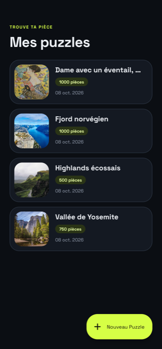
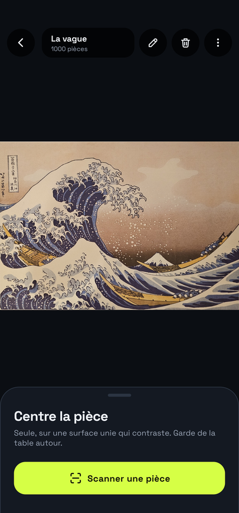
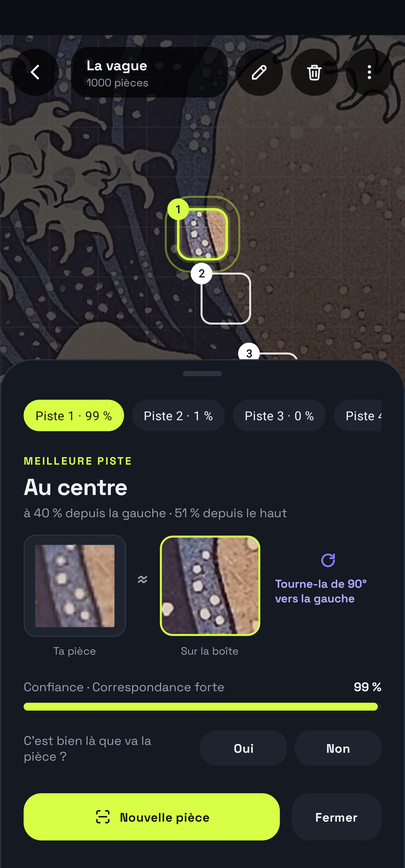
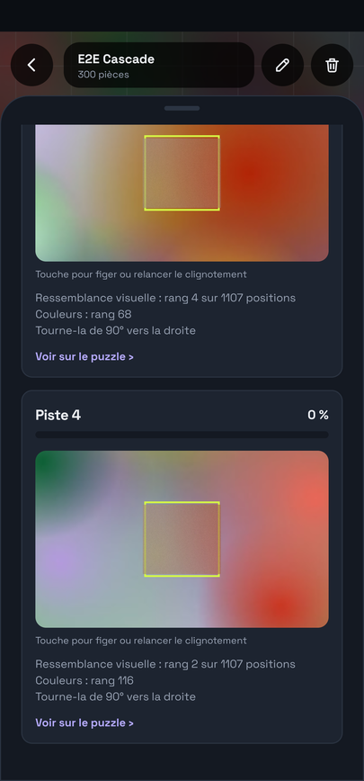
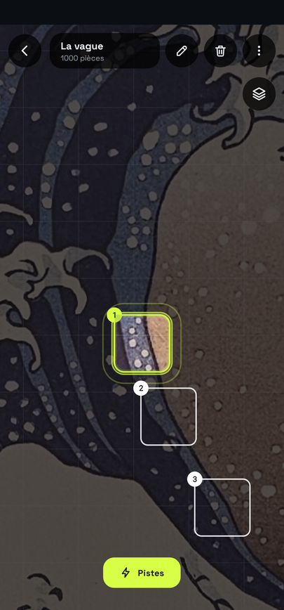
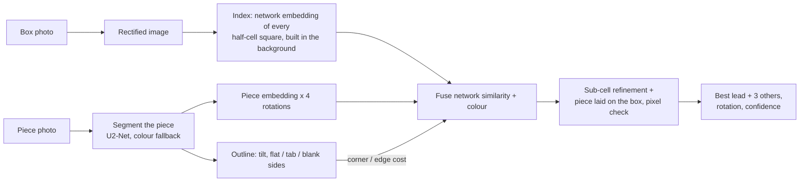
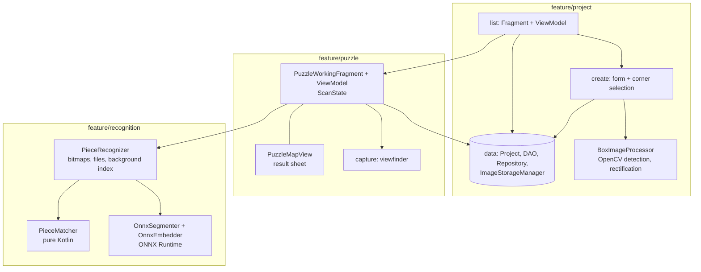
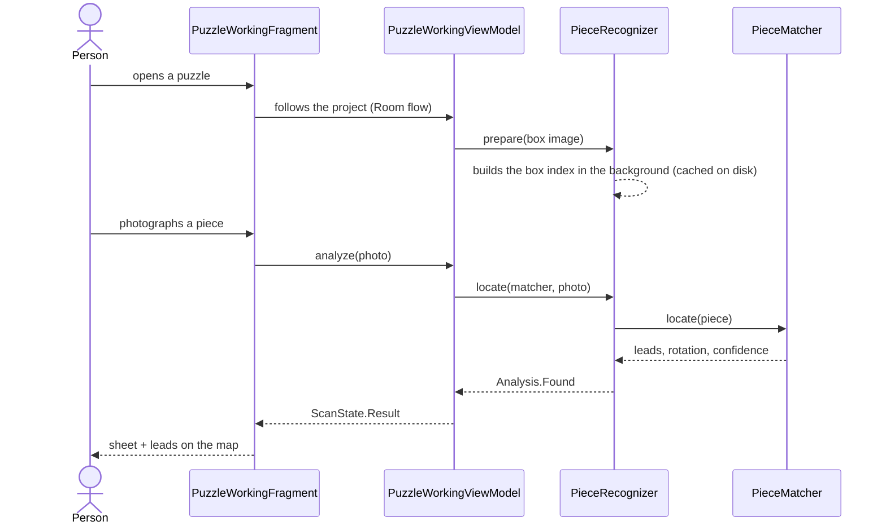

# PuzzleIt

[](https://github.com/LilyanLefevre/PuzzleIt/actions/workflows/ci.yml)


Stuck on a 1000-piece sky? Photograph a loose piece and PuzzleIt shows **where it goes on the box image**, how to
turn it, and how sure it is. Android, Kotlin, fully offline.

[PuzzleIt!](https://github.com/user-attachments/assets/551506ba-1c97-4705-9ffc-f8ffcfc742d6)

*Recorded on a phone ([`DemoTourTest`](app/src/androidTest/java/com/lilyan_lefevre/puzzleit/e2e/DemoTourTest.kt) plays it): a
piece of Hokusai's Great Wave is photographed, found with 99 %, then the result sheet goes through its four levels (the
leads, the piece next to the box, why these leads, hidden) and a lead card brings you back to the map.
[Video file](documentation/screenshots/demo.mp4).*

| My puzzles | Puzzle table | A piece found | Why these leads | Free map |
|---|---|---|---|---|
|  |  |  |  |  |

Every lead is a piece-sized square on the map with its share of confidence; the sheet lays the piece, turned the right
way, next to the box at the selected lead so you can check it by eye. A blurry photo or an empty table is refused with a
message (`documentation/screenshots/blurry.png`).

Demo box photos: Alexey Topolyanskiy, Andrew Ridley and Christian Joudrey on [Unsplash](https://unsplash.com) (Unsplash License).

## Features
- Scan the box once: the photo is straightened (OpenCV) and becomes the reference image. No grid to type.
- Scan a piece: up to 4 leads with rotation and confidence, ordered by confidence.
- Works on any puzzle, from a 200-piece photo to a 1000-piece sky; no account, no network, no data leaves the phone.
- Edit or delete a puzzle from the table's top bar.

## How it works



Three signals are mixed: a MobileNetV3-small trained on synthetic piece photos (ONNX Runtime) compares the piece with every
square of the box; a 5x5 Lab colour grid compares colour after removing overall tint, side light and contrast; the outline
says whether the piece belongs to the border and how it must turn. The best leads are then checked by laying the piece on the box.

The science, step by step (in French): [`documentation/`](documentation/README.md).

### Measured accuracy (exact cell, first lead)

| Benchmark | Result |
|---|---|
| 24 real images as 500-piece puzzles, 576 simulated piece photos | 88 % (97 % textured, 73 % flat-heavy) |
| Puzzle-Map, 643 real hand-held photos, 7 puzzles (public dataset) | 84 % with the app's pipeline, rotation 88 % |
| The author's own photos (200-piece Famillez, 1000-piece La vague) | 50 % first lead, 65 % in the 4 leads: the weak spot, mostly plain sky or foam pieces |

Scan time on a phone: about 1.5 s for the slowest scan, plus 3 s once per puzzle to index the box (300 pieces).
Details, rejected tries and protocol: [`documentation/07-validation.md`](documentation/07-validation.md).

## Architecture

Single activity, **package by feature**, **MVVM** (one ViewModel per screen, fragments only render and navigate), Hilt,
Room, CameraX, OpenCV for the box framing, ONNX Runtime for the two models. The matching algorithm is plain Kotlin,
tested on the JVM.





| Package | Content |
|---|---|
| `core/database` | Room database, migrations, Hilt module |
| `core/image` | image helpers shared by features (EXIF rotation, warp, camera file) |
| `core/ui` | reusable views: corner selection, loader |
| `feature/project` | `data/` (entity, DAO, repository, image storage), `list/`, `create/` (form, box framing) |
| `feature/puzzle` | the puzzle table (map, result sheet, scan state machine) and `capture/` (piece viewfinder) |
| `feature/recognition` | `PieceMatcher` (algorithm), `PieceRecognizer` (files, bitmaps, index), ONNX wrappers |

Other folders: `tools/dataset` (benchmark data builders, labelling page), `tools/ai` (training of the embedding
network), `tools/pc` (remote emulator scripts), `documentation/` (French, the science page by page).

## Build and test

```bash
./gradlew assembleDebug testDebugUnitTest         # JDK 21
./gradlew pixel6api34DebugAndroidTest              # instrumented tests on a Gradle Managed Device (Pixel 6)
./gradlew smallphoneapi34DebugAndroidTest -Pandroid.testInstrumentationRunnerArguments.package=com.lilyan_lefevre.puzzleit.e2e
```

Do not run `connectedDebugAndroidTest` while a phone is plugged in: Gradle uninstalls the app afterwards and wipes its
data. On a real phone: `./gradlew installDebug installDebugAndroidTest`, then
`adb shell am instrument -w com.lilyan_lefevre.puzzleit.test/com.lilyan_lefevre.puzzleit.HiltTestRunner`.

| Suite | Where | What |
|---|---|---|
| `PieceMatcherTest` | JVM | synthetic box art, rotated pieces, accuracy, rotation, blur, empty table |
| `DatasetReplayTest` | JVM, opt-in | 643 real photos of the public Puzzle-Map dataset |
| `ImageBankBenchmarkTest` | JVM, opt-in | 24 real images as 500-piece puzzles, 576 simulated piece photos |
| `OwnPuzzlesTest`, `RealPhotoReplayTest` | JVM, opt-in | the author's photos with exact labelled positions; captures pulled from a phone |
| `PieceRecognizerDeviceTest` | device / emulator | real JPEG decode, timing, memory, failure paths |
| `ScanFlowTest` | device / emulator | full journeys: list, table, scan, leads, sheet gestures, blurry, no piece, edit, delete |

The opt-in benchmarks read their data from environment variables (`PUZZLE_DATASET_DIR`, `PUZZLE_IMAGES_DIR`,
`PUZZLE_OWN_DIR`) built by the scripts in `tools/dataset`.

### CI

Every push to `main` runs the unit tests, then the instrumented suite on two Gradle Managed Devices in parallel
(a Pixel 6 and a 320 dp-wide small phone, Android 14 emulators).

## Contributing
Conventional commits (`feat:`, `fix:`, `test:`, `docs:`, `ci:`, `chore:`), one topic per commit, a matcher change is
kept only if it holds on both benchmarks. Project notes for coding assistants live in [`.claude/CLAUDE.md`](.claude/CLAUDE.md).
