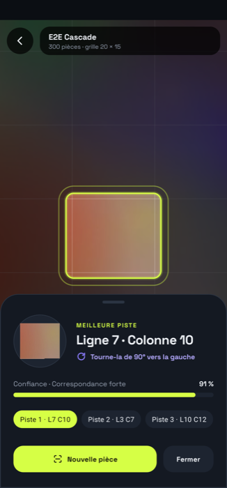
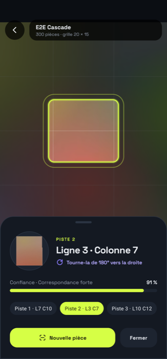
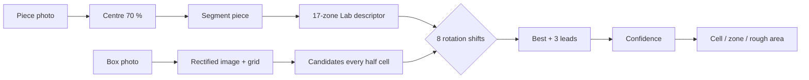
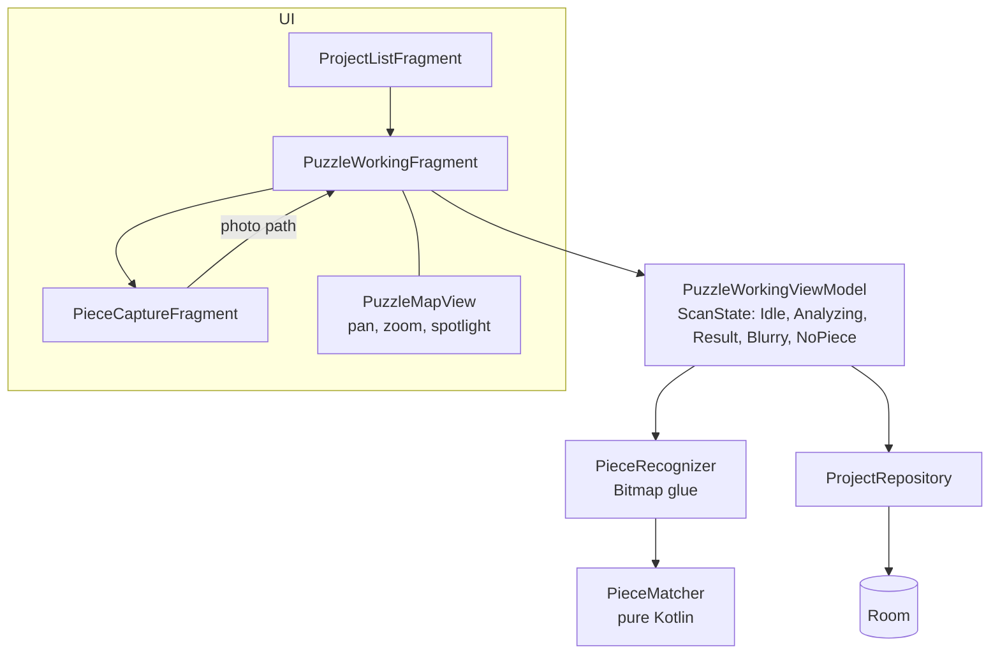

# PuzzleIt

[](https://github.com/LilyanLefevre/PuzzleHelper/actions/workflows/ci.yml)

Stuck on a 1000-piece sky? Photograph a loose piece and PuzzleIt shows **where it goes on the box image**,
how to turn it, and how sure it is. Android, Kotlin, fully offline.

| Puzzle table | Result | Second lead | Blurry photo |
|---|---|---|---|
|  |  |  |  |

*(captures from the instrumented tests, on synthetic box art)*

## How it works



Colour is compared in 17 zones (centre + 2 rings x 8 sectors) of a disc scaled to the piece size, so scale and
lighting matter little; rotating the piece is a cyclic shift of the sectors. Code: `feature/recognition/PieceMatcher.kt`.

## Build and test

```bash
./gradlew assembleDebug testDebugUnitTest      # JDK 21
./gradlew connectedDebugAndroidTest            # phone or emulator
```

## Architecture

Single activity, MVVM, Hilt, Room, CameraX, OpenCV (box rectification). The matching algorithm is plain Kotlin,
so it runs and is tested on the JVM.



| Path | Role |
|---|---|
| `feature/recognition` | `PieceMatcher` (algorithm), `PieceRecognizer`, `PuzzleMapView`, `PuzzleLoaderView` |
| `feature/puzzle` | working screen, scan state machine, piece capture |
| `feature/project` | project list, creation, box bounds |
| `shared` | Room database, image utils, shared views |

## Tests

| Suite | Where | What |
|---|---|---|
| `PieceMatcherTest` | JVM | synthetic box art, rotated pieces, accuracy, rotation, blur, empty table |
| `PieceRecognizerDeviceTest` | device / emulator | real JPEG decode, timing (< 3 s per scan), failure paths |
| `ScanFlowTest` | device / emulator | full journey: list, table, scan result, leads, blurry, no piece, viewfinder |

CI runs everything on each push to `main`, including an Android 14 emulator.

## Contributing
Conventional commits (`feat:`, `fix:`, `test:`, `docs:`, `ci:`, `chore:`), one topic per commit.
Project notes for AI assistants live in [`.claude/CLAUDE.md`](.claude/CLAUDE.md).
