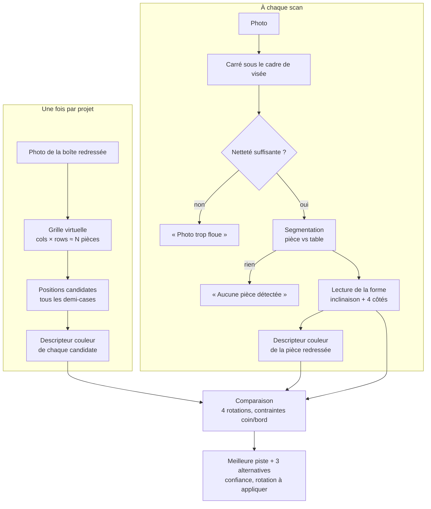

# 01 — Vue d'ensemble

## Le problème

On a deux images très différentes :

- **la boîte** : l'image complète, nette, imprimée, vue de face ;
- **la pièce** : un fragment d'environ 1/N de cette image, photographié au téléphone, tourné d'un angle inconnu,
  éclairé autrement, posé sur une table, avec une découpe (tenons, mortaises, côtés plats).

Il faut trouver **où** ce fragment se trouve dans l'image de la boîte, **comment le tourner**, et **à quel point on en
est sûr**. L'app reste une aide : elle propose une case, une zone ou une région selon sa confiance, jamais une réponse
imposée.

## La chaîne complète

## Les idées clés

1. **Travailler à la bonne échelle.** La pièce et une case de la grille couvrent la même surface : on compare donc
   des grilles de même taille relative, quelle que soit la distance de prise de vue ([05](05-descripteur-couleur.md)).
2. **Redresser avant de comparer.** Les bords droits de la pièce donnent son inclinaison ; il ne reste ensuite que 4
   rotations à tester au lieu d'une infinité ([04](04-forme.md)).
3. **La forme est un indice gratuit et fiable.** Un côté plat ne peut être que sur le bord du puzzle, deux côtés plats
   adjacents que dans un coin, et cela fixe aussi la rotation ([04](04-forme.md)).
4. **Comparer des couleurs, pas des pixels.** Lumière, balance des blancs et impression diffèrent entre la boîte et
   la pièce : on compare la structure des couleurs, une fois retirés niveau, dégradé de lumière et contraste
   ([05](05-descripteur-couleur.md)).
5. **Dire quand on n'est pas sûr.** La confiance combine « mieux qu'un endroit au hasard » et « mieux que la
   deuxième meilleure piste » ([06](06-decision-confiance.md)).

## Pourquoi pas de réseau de neurones ?

Contraintes du projet : 100 % hors ligne, réponse < 3 s sur un téléphone, résultats
reproductibles et explicables (« même photo, même suggestion »). Une approche géométrique + couleur tient ces
contraintes et se teste de façon déterministe sur la JVM. Sur 484 photos réelles, la bonne case est la première
piste 65 % du temps et dans les 4 pistes 89 % du temps ([07](07-validation.md)).
Un modèle appris reste une piste pour les images très répétitives (ciel, mer).
