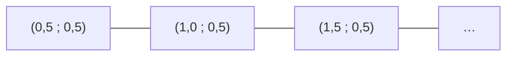

# 02 — La boîte et sa grille

## Image de référence

À la création d'un projet, la photo de la boîte est **redressée** (perspective corrigée à partir des 4 coins choisis
par l'utilisateur) et enregistrée (`Project.warpedPath`). C'est elle qui sert de référence ; les anciens projets
retombent sur l'image recadrée (`imagePath`).

Elle est réduite pour qu'une case fasse environ **20 pixels** de large (plafond 1600 px) : assez pour 17 couleurs
moyennes par case, assez peu pour que la préparation tienne en une fraction de seconde.

## Prédécoupage virtuel

Un puzzle de N pièces sur une image de rapport largeur/hauteur `a` est découpé en une grille `cols × rows` :

```
cols = round(√(N · a))
rows = round(N / cols)
```

Exemple : 1000 pièces sur une image 3:2 → 39 × 26 = 1014 cases. Si l'utilisateur a saisi le nombre de lignes et de
colonnes à la création (`gridRows`, `gridCols`), c'est cette grille qui est utilisée.

La grille est **virtuelle** : les vraies pièces ne sont pas des carrés parfaits et leurs centres ne tombent pas
exactement sur ceux de la grille. D'où les positions candidates au demi-pas.

## Positions candidates



Un candidat est placé **tous les demi-cases**, de 0,5 à `cols − 0,5` en colonne et de 0,5 à `rows − 0,5` en ligne :
environ 4 × N candidats (≈ 4 000 pour 1000 pièces). Pour chacun, le descripteur couleur de la boîte est calculé
une seule fois, à l'ouverture du projet.

Un candidat **touche le bord** du puzzle si sa ligne vaut 0,5 (bord haut) ou `rows − 0,5` (bas), ou sa colonne
0,5 (gauche) ou `cols − 0,5` (droite). Cette information sert aux contraintes de forme ([04](04-forme.md)).
