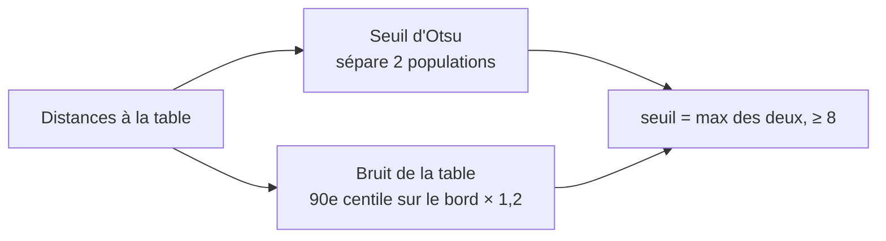

# 03 — Isoler la pièce

Avant de comparer quoi que ce soit, il faut savoir **quels pixels de la photo sont la pièce**. C'est l'étape qui
casse le plus souvent en conditions réelles ; elle a été revue après les premiers essais sur de vraies pièces.

## 1. La zone analysée

On n'analyse que le **carré centré** de côté égal à la moitié du petit côté de la photo (`PieceRecognizer.CROP = 0.5`).
Ce carré correspond à ce que l'utilisateur voit autour du cadre de visée, avec une marge de table.

> Erreur corrigée : la première version analysait 70 % de la photo dans chaque dimension, **plus large que l'écran**
> (l'aperçu caméra est rogné sur les côtés). La zone analysée contenait des choses invisibles pour l'utilisateur
> (sa main, d'autres pièces). Et la consigne « remplis le cadre » poussait à coller la pièce aux bords, là où
> l'algorithme lit la couleur de la table. La consigne est maintenant « garde de la table autour ».

L'image est ensuite réduite à 300 px de côté maximum.

## 2. Netteté

Variance du **laplacien** de la luminance : une image nette a beaucoup de transitions brusques, une image floue
presque aucune. En dessous de `MIN_SHARPNESS = 12`, l'app demande de reprendre la photo.

## 3. Couleur de la table

On prend une **bande de 5 %** sur le pourtour de l'image : c'est la table. Sa couleur de référence est la
**médiane** de ces pixels en Lab (robuste à une autre pièce ou une ombre qui dépasserait).

Pour chaque pixel, on calcule sa distance à cette couleur :

```
d = √( 0,5·ΔL² + Δa² + Δb² )
```

La luminance L compte moitié moins que la teinte : une ombre ou un dégradé de lumière change surtout L.

## 4. Seuil : Otsu + plancher de bruit



- **Otsu** choisit automatiquement le seuil qui sépare le mieux deux populations (table / pièce) dans l'histogramme
  des distances. Il s'adapte au contraste réel de chaque photo, au lieu d'un seuil fixe.
- Le **plancher de bruit** empêche Otsu de couper au milieu du grain d'une table texturée quand la pièce est petite.

## 5. Nettoyage du masque

1. **Ouverture** (érosion puis dilatation 3×3) : supprime les grains isolés et les ponts fins (une ombre, une fibre
   du bois).
2. **Composante sous le centre** : parmi les taches, on garde celle qui contient le centre de l'image (là où
   l'utilisateur a mis la pièce), sinon la plus grande.
3. **Remplissage des trous** : les zones de la pièce qui ressemblent à la table (un ciel beige sur une table beige)
   sont réintégrées si elles sont entourées par la pièce.
4. Garde-fous : la pièce doit couvrir entre 2 % et 85 % de l'image, sinon « aucune pièce détectée ».

## Limite connue

La méthode repose sur un **contraste de couleur entre la pièce et la table**. Une pièce grise sur une table grise
n'est pas séparable par la couleur seule ; l'app le dit au lieu d'inventer une réponse. Pistes : utiliser aussi les
contours (gradient), ou `grabCut` d'OpenCV (déjà embarqué) initialisé avec le cadre.
