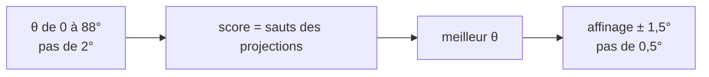
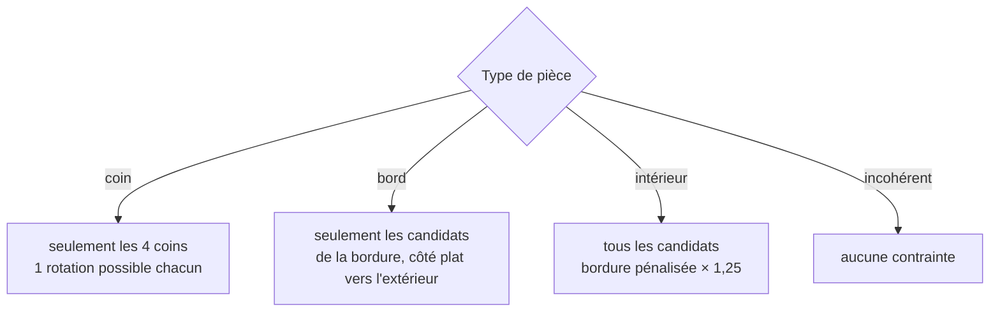

# 04 — Lire la forme

Une pièce de puzzle a un **corps** à peu près carré et quatre côtés, chacun :

| Côté | Description | Ce qu'il implique |
|---|---|---|
| **plat** | droit sur toute sa longueur | ce côté est sur le **bord** du puzzle |
| **tenon** | une excroissance arrondie au milieu | intérieur |
| **mortaise** | un creux arrondi au milieu | intérieur |

Deux côtés plats adjacents = **coin**, un seul = **bord**, aucun = **intérieur**. C'est l'indice que tout
puzzleur utilise en premier ; l'algorithme fait pareil.

## 1. Trouver l'inclinaison

La pièce est photographiée à un angle quelconque. On cherche l'angle `θ` (0–90°) qui **aligne ses côtés droits sur
les axes**.

Idée : on fait tourner le masque de `−θ` et on compte les pixels de la pièce par ligne et par colonne (projections).
Quand la pièce est droite, chaque côté droit produit un **saut brusque** dans ces projections (on passe d'un coup de
0 à toute la largeur du corps). Le score d'un angle est la somme des deux plus grands sauts en lignes et des deux
plus grands en colonnes :



Les tenons et mortaises n'occupent que le milieu de chaque côté ; les « épaules » droites suffisent à donner un pic
net.

## 2. Classer chaque côté

Le masque est ré-échantillonné **redressé** (tourné de `−θ`). On repère le corps : les lignes et colonnes dont plus
de 40 % sont de la pièce (un tenon est trop étroit pour compter, les épaules d'une mortaise sont assez larges).

Pour le côté du haut, on regarde la **bande centrale** (38 %–62 % de la largeur du corps) :

- juste **au-dessus** du corps (de 7 % à 22 % de sa hauteur) : remplie à plus de 30 % → **tenon** ;
- sinon juste **en dessous** du bord (de 5 % à 17 %) : remplie à moins de 50 % → **mortaise** ;
- sinon → **plat**.

Les trois autres côtés sont lus de la même façon après rotation du masque de 90°.

## 3. Contraindre la recherche



Pour un candidat donné et un quart de tour `q` (0–3), les côtés plats de la pièce redressée, une fois tournés de
`q × 90°`, doivent être **exactement** les côtés du candidat qui touchent le bord. Sinon le couple (candidat,
rotation) est éliminé. Pour un coin, cela ne laisse qu'**une** rotation par coin.

Une lecture incohérente (3 ou 4 côtés plats, deux plats opposés) désactive les contraintes plutôt que de risquer
une erreur.

> **Sur les photos réelles, la lecture se trompe souvent** (tenons en champignon, pièces inclinées) : une pièce
> intérieure lue « bord » éliminait la bonne case d'emblée (4 photos sur 4 d'une même pièce). Quand le réseau cherche
> dans toute la boîte ([08](08-ia.md)), la contrainte devient donc un **coût** : une rotation dont les plats ne
> correspondent pas au bord voit son score multiplié par 1,4 (`PieceMatcher.BORDER_PENALTY`). Famillez réel : 5 → 30 % de
> case exacte, banque d'images inchangée. Avec le matcher couleur seul (sans réseau), le mur est conservé : la couleur
> est trop faible pour s'en passer (test de lumière latérale 11/12 → 8/12).

## 4. Rotation finale annoncée

L'utilisateur doit tourner la pièce de `θ` dans le sens inverse (pour la redresser), puis de `q × 90°` dans le sens
horaire. La consigne affichée est donc :

```
rotation horaire = (q × 90° − θ) mod 360°
```

présentée comme « tourne-la de X° vers la droite » ou « vers la gauche » selon le plus court.
